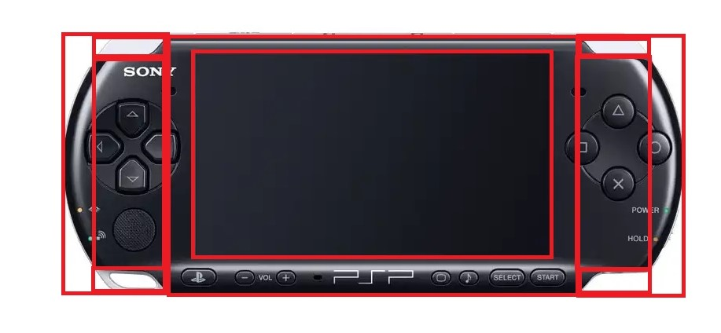
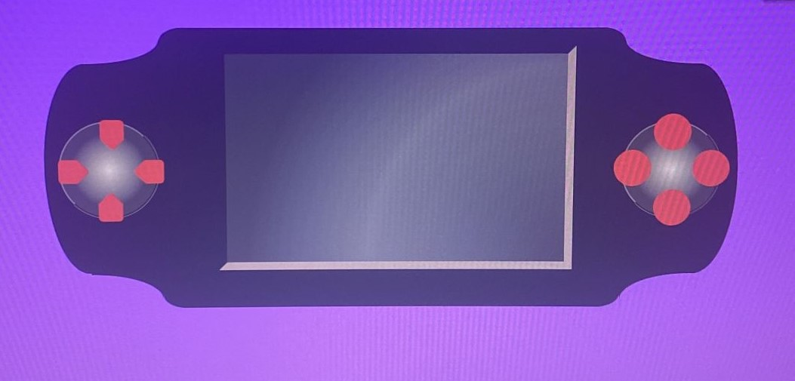
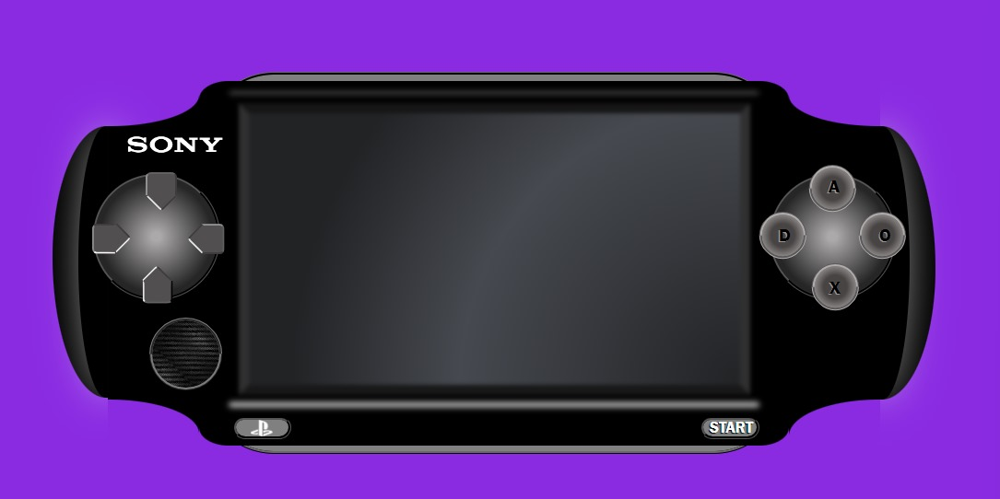
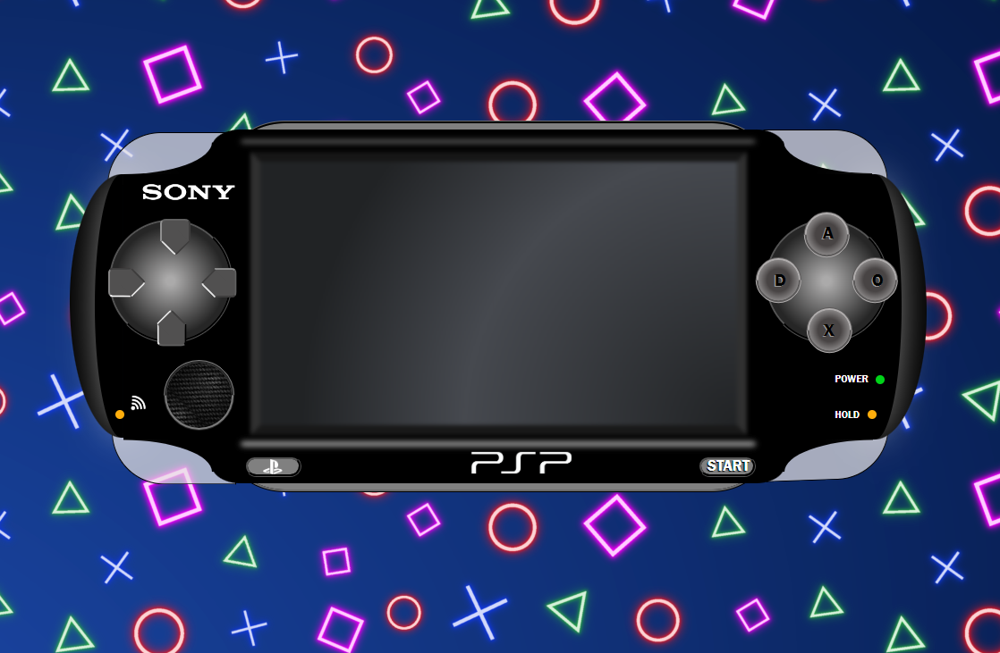
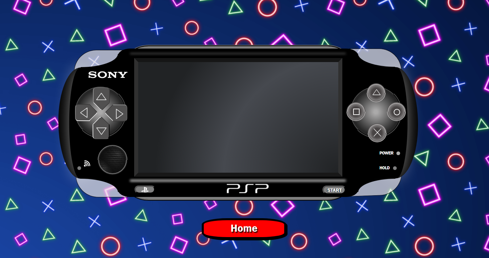
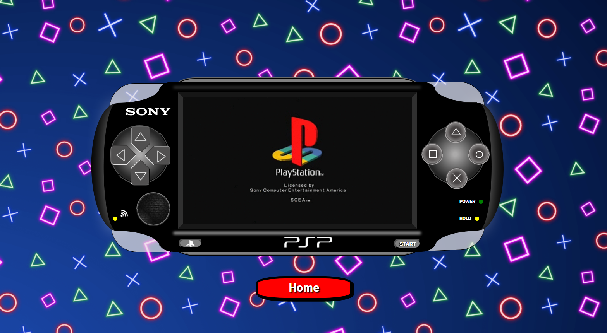
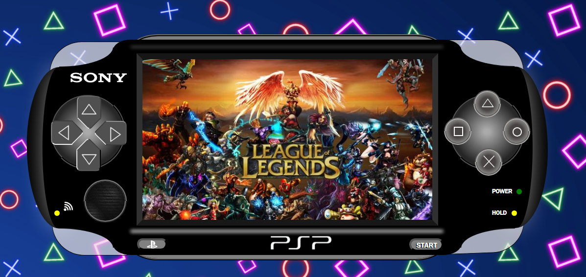
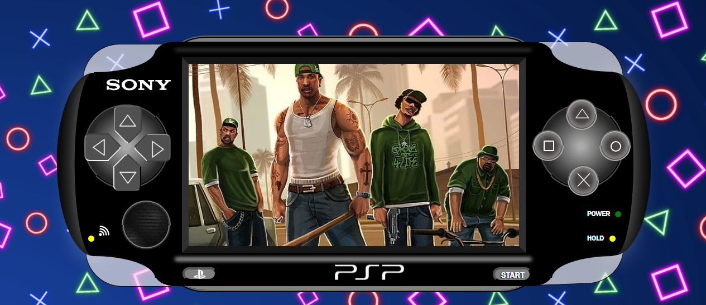
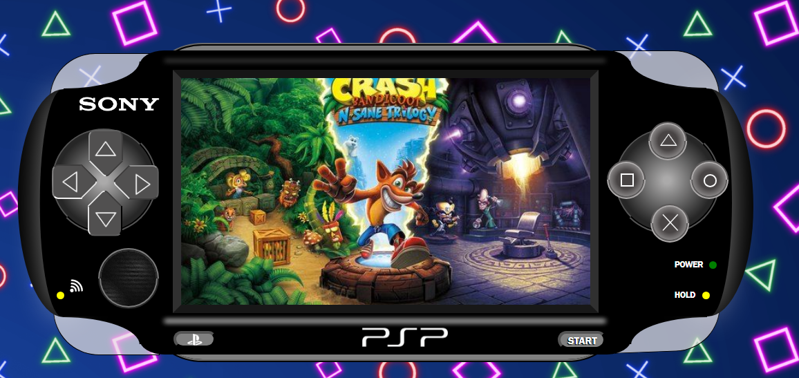
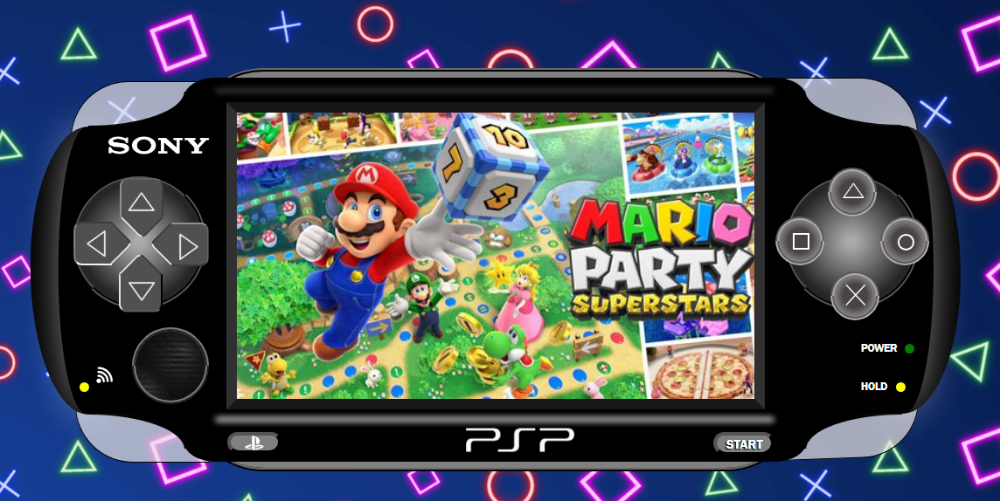

# Videoconsola PSP

La PlayStation Portable (PSP) es una videoconsola portátil de la multinacional de origen japonés, y la cuarta consola de Sony en ser diseñada por Ken Kutaragi, PSP servía para videojuegos, conectarse a internet y reproducir y ver multimedia. Se trata de la primera consola portátil a nivel mundial de Sony.

## Contenido

- [Introducción](#introducción)
- [Características](#características)
- [Tecnologías](#tecnologías-utilizadas) 
- [Agradecimiento](#agradecimientos)
- [Algunos Errores](#algunos-errores)
- [Captura de Pantalla](#capturas-de-pantalla)
 
 

## Introducción

Todo empieza con la idea de hacer una clásica GameBoy como segundo proyecto pero las ganas de retarme a mí mismo y llevarme un paso más allá de mis conocimientos han hecho que este proyecto fuese un continuo ensayo y error, permitiendo así mejorar mis capacidades, conocer más el lenguaje de CSS e iniciarme en JAVASCRIPT. 

La decisión de decantarme por la PSP ha sido sin más por suponer un reto conseguir las formas y la posibilidad de llevarla lo más posible al realismo.

## Características

Esta videoconsola consta de dos mandos, uno en el lateral derecho y otro en el izquierdo. Ambos con la misma posibilidad de cambiar imágenes pero con la diferencia de que los botones del lateral derecho tienen cada uno asignada una imagen y las del lateral derecho podemos desplazarnos por todas las imágenes de la galería, una por una. Además, cuenta con un botón de encendido el cual permite que se activen todas las funcionalidades de la consola.

La siguiente imagen representa como se inició el diseño para la elaboración de la PSP:

La PSP en crudo se veia así.

distintas fases

## Tecnologías Utilizadas

 
 
## Agradecimientos

Agradecimientos especiales a mi profesor David Ochando por su entrega y dedicación a la hora de formarnos en esta nueva aventura que es la programación y a mis compañeros por el apoyo y el aporte de ideas en la elaboración de este proyecto.

## Futuras mejoras

Algunas de las mejoras que se me han ocurrido para una segunda edición son: 

- Elaborar un menú del estilo carrusel para un pasando las imágenes.
- Poner seleccionar y ampliar las imágenes. 

- Aplicar funcionalidades a botones superiores 

## Capturas de Pantalla

 
